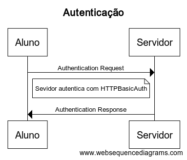

# Guia para os desenvolvedores

## Como configurar o ambiente de desenvolvimento

1. Criar uma base de dados quiz.db através do sqlite3.
   `$ sqlite3 quiz.db`
2. Rodar as queries presentes no arquivo quiz.sql no terminal do sqlite aberto nessa base de dados.
3. Popular um arquivo users.csv com usuarios(\*Obs: logins 'admin' e 'fabioja' são reservados para professores).
4. Rodar o script adduser.py para adicionar esses usuarios na base de dados.
5. Rodar o arquivo softdes.py, que irá inicializar o servidor do programa.

## Instalação do software

sqlite3, Flask, Flask_httpauth, hashlib e python3 são pacotes necessários para rodar o servidor.

## Estrutura do código em alto nível

O presente software oferece uma plataforma para os alunos de Design de Software submeterem suas respostas aos quizzes da matéria por meio de comunicações de API,
seguindo o padrão REST. O servidor recebe o arquivo com a solução de determinado quizz e devolve ao aluno um feedback sobre a validade ou não da sua resposta. Os seguintes
diagramas mostram dois importantes fluxos de eventos:

-   Autenticação de usuário:

-   Envio de respostas:

