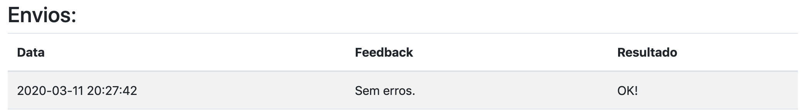

# Guia para os alunos

## Como usar

-   `http://localhost:80` - Link de acesso.
-   `Dashboard lateral esquerda` - Escolher desse menu o desafio que queira responder.
-   `Escolher Arquivo` - Botão para selecionar o código fonte com sua solução.
-   `Enviar` - Botão de envio.

## Resposta correta

Caso sua resposta esteja correta, o Feedback e o Resultado devem sair como na imagem a seguir:

## Resposta errada

Caso sua resposta esteja errada, o Feedback e o Resultado devem sair como na imagem a seguir:

