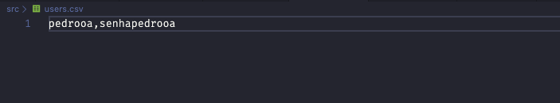
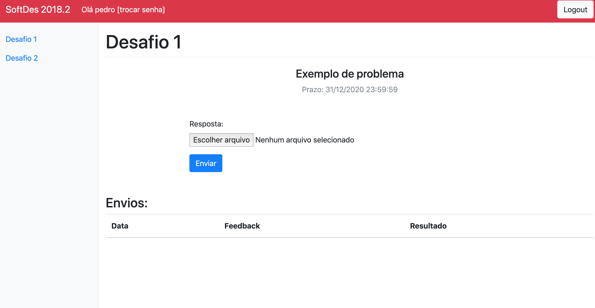

# Guia para os professores

## Como adicionar usuarios

Para adicionar novos usuários é necessário alterar/criar um arquivo users.csv na raíz do projeto.
Ele deve ser populado linha por linha, em que cada linha representa um aluno, no formato : Login,Senha

Feito isso, o script add_user.py deverá ser rodado para adicionar na base de dados os novos usuários.

## Como adicionar novos desafios

Entrar na base de dados através do sqlite3 e rodar a uma query de inserção na table QUIZ.

Exemplo:

Insert into QUIZ
(numb, release, expire, problem, tests, results, diagnosis)
values
(2, '2018-08-02', '2020-12-31 23:59:59', 'Exemplo de problema-novo', '[[1],[2],[3]]', '[0, 0, 0]', '["a","b","c"]')

Na imagem acima é possível verificar que o novo desafio foi inserido e está visível como "Desafio 2" no menu lateral.
